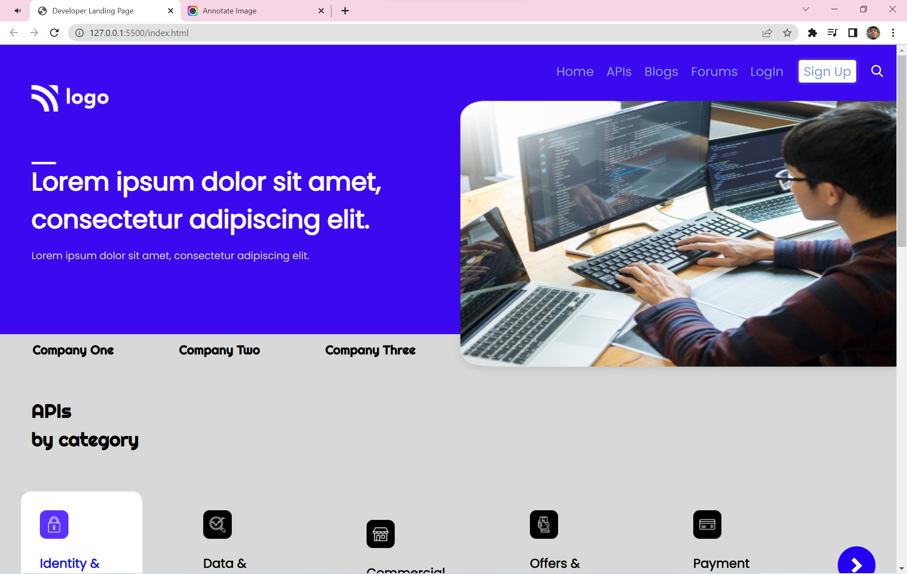
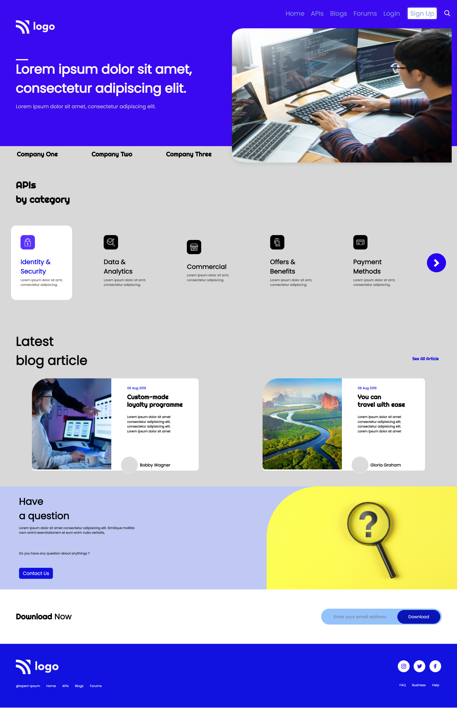

# Project-9 HTML & CSS Full Stack Javascript Web Development Course

## About

This project is created using HTML and CSS. I have used CSS flex-box to make this project and this project is responsive.

## What did I learn by making this project?

- learn more about flex-box while creating this project.
- learn about media query.

## Time taken to finish this project?

This project took me around 6 hour to finish.

## Screenshots

